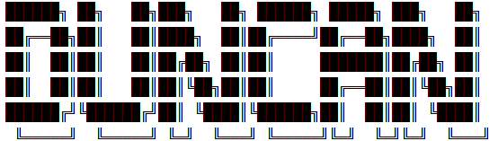
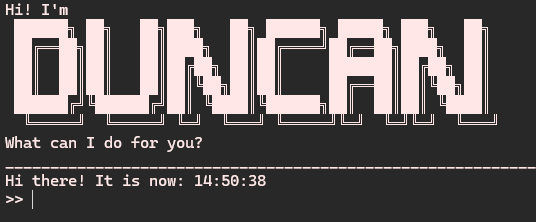
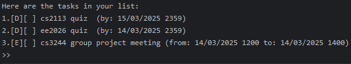
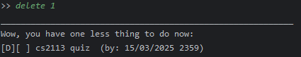
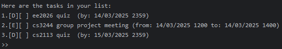
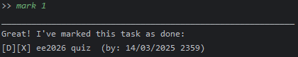
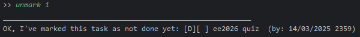
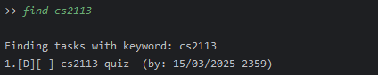
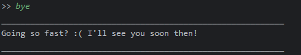

okay. Could you help me create a section at the very top with quick links to each part of the user guide?

## Table of Contents
- [Introduction](#introduction)
- [Quick Start](#quick-start)
- [Features](#features)
   - [Viewing help](#viewing-help-help)
   - [Adding a to-do](#adding-a-to-do-todo)
   - [Adding a deadline](#adding-a-deadline-deadline)
   - [Adding an Event](#adding-an-event-event)
   - [Deleting Tasks](#deleting-tasks-delete)
   - [Marking/Unmarking tasks](#markingunmarking-tasks-mark-unmark)
   - [Listing Tasks](#listing-tasks-list)
   - [Finding tasks](#finding-tasks-find)
   - [Exiting the program and Saving the list](#exiting-the-program-and-saving-the-list-bye)
   - [Editing the data file](#editing-the-data-file)
   - [Summary of Comands](#summary-of-commands-)



## Introduction
Duncan is a friendly command-line interface (CLI) chatbot to help you organise your tasks!

## Quick Start
1. Ensure you have Java 17 installed on your computer.
2. Move or copy the `.jar` file from the root of this repository to a desired location on your machine (files will be created there).
3. Run the `.jar` file by running `java -jar duncan.jar` in a terminal at the location you put the `.jar` file in. Note that double-clicking it might produce a Java exception. A greeting message should be printed to the output:
   
4. Type a command in the terminal and press enter to execute it. Below is a list of sample commands you may try. Refer to the corresponding feature sections for a more details about each command.
    - `todo read book`: adds a to-do task named "read book"
    - `deadline submit iP /by 14/3/2025 2359`: adds a deadline named "submit iP", for you to complete by 14th March 2025 at 2359 hrs.
    - `list`: lists all tasks in your list.
    - `mark 1`: marks the first task in your list.
    - `bye`: exists the app.
## Features

>  **Notes about the command format**:
> - Uppercased words in angled brackets,  `<UPPER_CASE>` are the parameters to be supplied by the user.
> - e.g. for `todo <TASK NAME>`, `TASK NAME` is a parameter, which can be `read book.`
> - Extraneous parameters for commands that do not take in parameters (such as `list`, `bye`) will be ignored.

### Viewing help: `help`
Shows the URL link to this page.
### Adding a to-do: `todo`
Adds a to-do to the task list. The to-do does not have any time associated with it.
```
todo <TASK NAME>
```
**Examples**
1. `todo read book`
### Adding a deadline: `deadline`
Adds a deadline to the task list. The deadline has **exactly one** time stamp associated with it.
``` 
deadline <TASK NAME> /by <TIME>
```

> **Tip**: Time Formats
> Duncan can understand a few different date formats. Generally, times can be provided as such:
> -   `MM dd yyyy`, `dd MM yyyy`, `dd MM yy`, `MM dd yy`.
>
> A 24 hour time `HHmm` can also be specified after the date if the deadline has a specific time.
> Duncan can also understand relative dates. For example, if the current date is 13/3/2025, and the following command is given to Duncan:
> ```deadline CS2113 quiz /by this friday```, a deadline will be created for 2359 Hrs, for the first Friday that occurs after the current time.

**Examples**
1. `deadline CS2113 quiz /by 14/3/2025 2359`
2. `deadline CS2113 quiz /by this friday`
3. `deadline CS2113 quiz /by tomorrow`
### Adding an Event: `event`
Adds an event to the task list. The event has **exactly two** time stamps associated with it.
```
event <TASK NAME> /from <TIME> /to <TIME>
```
**Examples**
1. `event CS2113 lecture /from 14/3/2025 1600 /to 14/3/2025 1800`
2. `event CS2113 lecture /from this friday 1600 /to this friday 1800`
3. `event CS2113 lecture /from tomorrow 1600 /to tomorrow 1800`

### Deleting Tasks: `delete`
Deletes a specified task from the list by its number.
```
delete <TASK NUMBER>
```
If we had a list as such:\
\
We could delete the **first** entry by doing `delete 1`:\
\
**Examples**
1. `delete 1`
### Marking/Unmarking tasks: `mark`/ `unmark`
Mark or unmark a specified task in the list by its number.
```
mark <TASK NUMBER>
unmark <TASK NUMBER>
```
If we had a list as such: \
\
We could mark the **first** entry by doing `mark 1`:\
\
We can unmark the task that we just marked:\
\
**Examples**
1. `mark 1`
2. `unmark 1`

### Listing Tasks: `list`
Lists all tasks and their respective information in your list.
```
list
```

### Finding tasks: `find`
Finds all tasks in your list that match the specific keyword provided.
```
find <KEYWORD>
```
If you had a few tasks:\
\
And you just wanted all tasks with `cs2113`:\
\
**Examples**
1. `find cs2113`

### Exiting the program and Saving the list: `bye`
Save and exit the program by saying bye to Duncan!
```
bye
```
Of course, he'll be sad to see you go:\


### Editing the data file
The task data is saved upon exit as a `.txt` file. If you are familiar with the format used to save the tasks, you may edit the file.

>  **Exercise caution when editing the file**
>
> - If your changes to the data file makes it format invalid, Duncan will discard all data and start with an empty file. Hence, it is advisable to backup the data in the files before editing.
> - Certain edits may cause unexpected behaviour from Duncan. 


### Summary of Commands 

| Action   | Format,                                    | Examples                                                                                                                     |
| -------- | ------------------------------------------ | ---------------------------------------------------------------------------------------------------------------------------- |
| todo     | `todo <TASK NAME>`                         | `todo read book`                                                                                                             |
| deadline | `deadline <TASK NAME> /by <TIME>`          | `deadline CS2113 quiz /by 14/3/2025 2359`,`deadline CS2113 quiz /by tomorrow`                                                |
| event    | `event <TASK NAME> /from <TIME> /to <TIME>` | `event CS2113 lecture /from 14/3/2025 1600 /to 14/3/2025 1800`, `event CS2113 lecture /from tomorrow 1600 /to tomorrow 1800` |
| delete   | `delete <TASK NUMBER>`                     | `delete 1`                                                                                                                   |
| mark     | `mark <TASK NUMBER>`                       | `mark 1`                                                                                                                     |
| unmark   | `unmark <TASK NUMBER>`                     | `unmark 1`                                                                                                                   |
| list     | `list`                                     |                                                                                                                              |
| find     | `find <KEYWORD>`                           | `find cs2113`                                                                                                                |
| bye      |                                            |                                                                                                                              |


